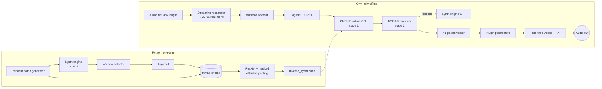
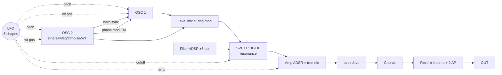

# InverseSynth: offline synthesizer parameter inference

Drop in an audio sample of any length. The plugin predicts the settings of its built-in synth with a neural network, then refines them with a genetic optimiser until the synth sounds like the sample. Everything runs locally on the CPU and needs no internet connection.

```
python/   dataset generation, training, ONNX export, reference engine, tests
cpp/core/ dependency-free C++17: synth, FX, features, ONNX predictor, NSGA-II
cpp/plugin/  JUCE VST3 / AU / Standalone shell
.github/workflows/build.yml   builds the plugin on GitHub for Win/macOS/Linux
```

## 1. Quick start

| Step | Command | Time |
|---|---|---|
| Install | `cd python && pip install -r requirements.txt` | minutes |
| Validation set | `python generate_dataset.py --out data/val --n 5000 --seed 999` | ~1 min |
| Training set | `python generate_dataset.py --out data/train --n 200000` | ~8 min on 8 cores |
| Train | `python train.py --train data/train --val data/val --epochs 40` | hours (GPU recommended) |
| Export | `python export_onnx.py --ckpt checkpoints/best.pt --out inverse_synth.onnx` | seconds |
| Try it | `python infer.py my_sound.wav --model inverse_synth.onnx` | 10–60 s |
| Build the plugin | push to GitHub → Actions tab → download `InverseSynth-<os>` | ~20 min |

To make the model available to the plugin, pick one of these:
- Copy `inverse_synth.onnx` to the user app-data folder:
  - Windows: `%APPDATA%\InverseSynth\`
  - macOS: `~/Library/InverseSynth/`
  - Linux: `~/.config/InverseSynth/`
- Click **Load model** in the plugin.
- Commit the model as `models/inverse_synth.onnx` so the CI build bundles it inside the plugin.

### Installing the built plugin
- **Windows:** copy `InverseSynth.vst3` to `C:\Program Files\Common Files\VST3\`.
- **macOS:**
  - Copy the `.vst3` to `~/Library/Audio/Plug-Ins/VST3/`.
  - Copy the `.component` to `~/Library/Audio/Plug-Ins/Components/`.
  - Run `xattr -dr com.apple.quarantine <bundle>` on each, because CI builds are ad-hoc signed and not notarised.
- **Linux:** copy the `.vst3` to `~/.vst3/`.

The ONNX Runtime library is already inside each bundle.

### Building locally instead
```
cmake -S cpp -B build -DCMAKE_BUILD_TYPE=Release
cmake --build build --config Release --parallel
```
You need CMake 3.22 or newer and a C++17 compiler: Visual Studio 2022, Xcode 14+, or GCC 11+. On Linux you also need the JUCE system packages listed in the workflow file. JUCE 8.0.4 and ONNX Runtime 1.20.1 download automatically.

## 2. System architecture



The two synth engines, `python/invsynth/engine.py` and `cpp/core/SynthVoice.cpp` + `Effects.cpp`, match line for line. The test `python tests/test_parity.py build/invsynth_cli` checks that they render the same audio, and that the mel features and window choice also match. The last measured worst-case relative error was 3×10⁻¹¹. Run this test after any change to the DSP code, because the network is trained on one engine and deployed on the other.

## 3. Phase 1: the synthesizer (41 normalised parameters)



| # | Group | Parameters |
|---|---|---|
| 0–4 | Osc 1 | wave (6-way), wavetable pos, level, coarse ±24 st, fine ±50 ct |
| 5–9 | Osc 2 | same as Osc 1 (osc 2 is the FM modulator and sync master) |
| 10–13 | Mod | FM amount, ring mix, sync (2-way), root pitch (MIDI 24–96) |
| 14–21 | Filter | type (3-way), cutoff 20 Hz–20 kHz (log), resonance, env amount ±6 oct, ADSR |
| 22–26 | Amp | ADSR (1 ms–10 s, log), gate = fraction of the note that is held |
| 27–32 | LFO | rate 0.05–20 Hz, shape (5-way), separate depth to pitch, cutoff, amp and wavetable |
| 33–40 | FX | drive, dist mix, chorus rate/depth/mix, reverb size/damp/mix |

Categorical parameters are stored as bin centres: class k of n is (k+0.5)/n.

Sound quality choices:
- Saw and square use PolyBLEP anti-aliasing.
- The filter is a Cytomic trapezoidal SVF, stable under fast modulation, with coefficients recalculated every 16 samples.
- The 8 wavetable frames are generated from a formula, so no asset files are needed.
- Noise and sample-and-hold use a fixed-seed generator, so renders are deterministic.

In the plugin, **MIDI note 60 plays the detected root pitch**. Other notes transpose relative to it.

## 4. Phase 2: variable-length data

- **Note lengths:** drawn log-uniformly between 1 and 10 s.
- **Musical priors:** most FX, LFO and FM depths are set to exactly 0, and tuning snaps to common intervals. Uniform random patches would sound mostly like noise.
- **Augmentation:** background noise and spectral tilt on half the examples. The labels stay the same, and this helps the model generalise to real recordings.
- **Windowing:** each note goes through the same window selector the plugin uses. The model trains on exactly what it will see at inference, plus a context vector `[window start / total length, window length / 5 s, total length / 60 s]`, so it can infer the gate and release across the whole note.
- **Storage:** each shard holds `mels.npy (128 × ΣT, fp16)` plus offsets. Clips keep their natural length with no padding, and training reads them via mmap, so the dataset never has to fit in RAM.

## 5. Handling variable-length time dimensions

1. **Front-end:** the audio is peak-normalised and its duration measured.
   - If it is 5 s or shorter, the whole clip is used.
   - Otherwise, each frame gets a density score: the clipped z-scores of spectral flux, frame loudness, and 0.5 × spectral entropy. A cumulative sum finds the 5 s window with the highest total in O(n).
   - The window start then moves back to the earliest detected onset within 2 s, so the attack is included.
2. **Network:** convolutions only up to pooling.
   - Batches are padded with the silence value (−1). A validity mask follows each time-downsampling step (T → T/8).
   - A CoordConv time channel runs from 0 to 1 across the valid frames, so the model knows where each frame sits in the clip.
   - Masked attentive statistics pooling (weighted mean + std) turns any T into a fixed 768-dim vector.
3. **Batching:** a bucket sampler sorts each chunk of 50 batches by length, so padding stays under about 5%.
4. **Export:** ONNX has a dynamic axis `mel: (1, 128, time)`. Batch is 1, so there is no padding or mask at runtime. The export test checks T = 22 … 900 against PyTorch (max error ≈ 1e-7).
5. **Finetuner:** the comparison window grows. It starts at the selected 5 s, then 2×, then the whole file, capped by *Max compare*. Each time it grows, the release and gate are re-fitted to the longer target. The gate is an absolute time measured on the full note, so it stays consistent across window sizes.

## 6. Phase 3: two-stage inference

**Stage 1: predictor.** A ResNet-18-style 2-D network (7.1 M parameters) feeds 3 dilated TCN blocks, then attentive stats pooling, then an MLP. From there, 36 sigmoid outputs handle the continuous parameters and 5 softmax heads handle the categorical ones. The loss uses a **relevance mask**: parameters that cannot affect the sound are left out. Examples are the wavetable position when the osc isn't a wavetable, or reverb size when the reverb mix is 0. Those labels are pure noise and would otherwise drag every other prediction toward the average.

**Stage 2: NSGA-II finetuner.** It optimises two objectives at once:
- **f₁ timbre:** multi-resolution STFT loss (FFT 512/1024/2048), combining spectral convergence and 0.1 × log-magnitude L1.
- **f₂ dynamics:** L1 difference between the RMS envelopes in dB (60 dB range).

Keeping the Pareto front (instead of a weighted sum) keeps "right timbre, wrong envelope" candidates alive, and these often combine into the correct patch.

The operators are:
- SBX crossover (η = 15) and polynomial mutation (η = 20) for continuous genes.
- Uniform crossover and 5% resampling for categorical genes.

The starting population is the stage-1 guess, a duration-matched copy of it, and Gaussian neighbours. The duration match fits:
- attack from the time to reach peak,
- gate from the last frame above −12 dB,
- release from the least-squares dB/s slope of the tail,
- sustain from the median level of the plateau.

The run stops when the loss falls below the tolerance or after `patience` generations without improvement. Cancelling keeps the best result found so far.

## 7. Phase 4: plugin runtime

| Thread | Work | Real-time rules |
|---|---|---|
| Audio | 8 voices, FX, preview playback | no locks (preview uses a try-lock), no allocation, 41 relaxed atomic loads per block; voice settings rebuilt only when a parameter changes |
| Worker | decode → resample → window → mel → ONNX → NSGA-II | one job at a time, cancellable, reports progress |
| Message | UI; applies results with `beginChangeGesture` / `setValueNotifyingHost` | host sees normal parameter changes (undo/automation-friendly) |

**Loading ONNX Runtime by full path at runtime:**
- Windows ships its own older `onnxruntime.dll` in System32, which a normal link can pick up by mistake.
- Plugin validators can still load the plugin even if the library is missing. Analysis then shows a clear message instead of the plugin failing to load.
- The model's front-end settings (sample rate, hop, mel count, parameter count) are stored in its metadata. The plugin rejects a model whose settings don't match.

**Memory and length:** there is no upper limit on file length. Decoding streams through `ResamplingAudioSource`, so memory grows with duration at 22.05 kHz: about 5 MB per minute, or about 300 MB for a one-hour file. The preview copy is capped at 120 s. Optimiser cost grows with the compared length, which *Max compare* limits.

## 8. Keeping it fast on a desktop CPU

- Stage 1 takes about 0.1–0.5 s. ORT uses 2 intra-op threads so it doesn't compete with the DAW. The int8 model (`export_onnx.py --int8`) shrinks the MLP; for a further speed-up, apply static QDQ quantisation to the conv layers.
- Stage 2 is the expensive part: population × generations renders plus 3 FFT sizes each. The defaults are 32 × 45 on all cores except one. Suggested next steps for more speed:
  - Replace `core/Fft.h` with pffft, Accelerate or IPP (about 5× faster).
  - Store the non-zero range of each mel filter row.
  - Use float instead of double in the voice.
  - Cache candidates that are identical after categorical rounding.
- The 5 s window and the coarse-to-fine comparison schedule mean early generations are cheap. Long files only cost more in the final stage.

## 9. Measured in development

The development sandbox has one CPU core.

| Item | Result |
|---|---|
| 5 s render (Python/numba) | 9 ms |
| Dataset generation | ~18 ms per example per core |
| Python ↔ C++ engine | worst relative error 3.1e-11 over 40 random patches |
| Mel features Python ↔ C++ | max absolute error 6.7e-5 |
| ONNX vs PyTorch, T = 22…900 | ≤ 1.2e-7 |
| C++ pipeline, 7 s file, 12 generations | 21.6 s |
| VST3 build (Linux, GCC 13, LTO) | compiles cleanly |
| pluginval, strictness 7 (incl. Steinberg VST3 validator, fuzzing, thread safety) | SUCCESS |
| Hosted test: MIDI 60 / 72 through the built VST3 | 261.5 Hz / 524.1 Hz, RMS ≈ 0.32, state round-trip OK |

These are plumbing checks. The model was trained for one epoch only, so it does not reflect real accuracy. The main risk for real samples is the gap between synthetic training audio and real recordings. After training, measure spectral loss on held-out real one-shots, and widen the augmentation (EQ, room reverb, pitch drift) if it stays high.

## 10. Honest limitations

- One synth architecture can only replicate sounds within its range: two oscillators, one filter, simple FX. Acoustic instruments will come out approximate.
- The system is designed for single notes or held tones. Polyphonic or melodic material is reduced to its densest window.
- Output is mono (duplicated to stereo) so it matches training exactly. For wider output, add a stereo chorus or reverb in the plugin only.
- Some parameter combinations sound identical, such as pitch versus coarse tuning, or cutoff versus filter-envelope amount. Stage 2 resolves these by sound rather than by parameter value.
